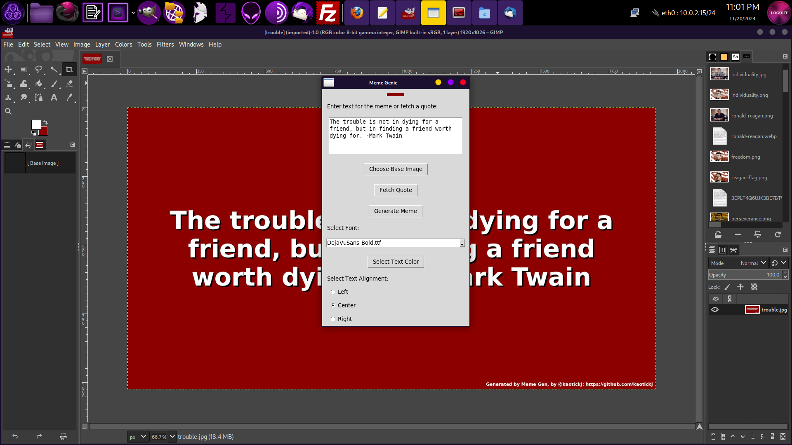

# Meme Genie



Meme Genie is a Python-based application designed to help users create memes effortlessly. Leveraging its intuitive interface and customizable templates, users can unleash their creativity and craft share-worthy memes with ease.

---

## Features
- **Random Quote Function**: One click to grab a random quote from a large quote database.
- **Text Customization**: Add, format, and position text as desired.
- **Background Image Selection**: Use your own images to create unique memes.
- **Export Options**: Save memes in multiple formats.

---

## Installation and Dependencies

### Prerequisites
Ensure you have the following installed:
- Python 3.7 or higher
- Virtual Environment (`venv`) module (optional but recommended)

### Installation Steps
1. Clone this repository:
   ```bash
   git clone https://github.com/yourusername/meme-genie.git
   cd meme-genie
   ```

2. Create and activate a virtual environment:
   ```bash
   python -m venv venv
   # On Windows
   venv\Scripts\activate
   # On macOS/Linux
   source venv/bin/activate
   ```

3. Manually install the required dependencies:
   ```bash
   pip install beautifulsoup4 Pillow
   ```

4. Verify the installation:
   ```bash
   python --version
   pip list
   ```

---

## Usage Instructions

### Running Meme Genie
To start the application, use the following command in your terminal:
```bash
python memegenie.py
```

### How to Use
1. **Select a Template**: Choose a base image for the background.
2. **Add Text**: Enter your desired text or grab a random quote and position it as needed.
3. **Export Your Meme**: Save the meme in your preferred format (e.g., PNG, JPEG).

---

## License
This project is licensed under the GNU General Public License (GPL). For more details, see the `LICENSE` file in the repository.

---

## Contributing
Contributions are welcome! Please fork the repository, make your changes, and submit a pull request. Ensure your contributions align with the GNU license.

---
